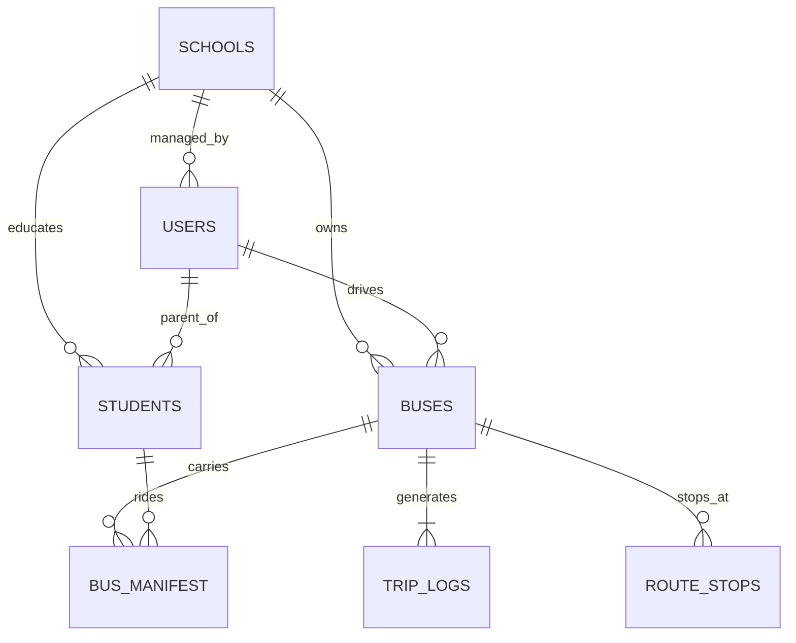

# 🗄️ Database Documentation

## Overview

The database uses **PostgreSQL 14+** with **PostGIS** extension for geospatial features. It stores user data, vehicle telemetry, real-time location logs, and system configuration.

### Extension
- **PostGIS**: Enabled (`CREATE EXTENSION postgis;`) to support `GEOMETRY(Point, 4326)` columns.

---

## 🏗️ Entity Relationship Diagram

---

## 📋 Core Tables

### 1. `schools`
Stores list of registered schools.
| Column | Type | Default | Description |
|---|---|---|---|
| `id` | SERIAL | PK | Unique School ID |
| `name` | TEXT | NOT NULL | School Name |

### 2. `users`
Central user table for ALL roles (Admin, Driver, Parent).
| Column | Type | PK? | Description |
|---|---|---|---|
| `id` | UUID | ✅ | Unique User ID |
| `name` | TEXT | | Full Name |
| `role` | TEXT | | `SUPER_ADMIN`, `SCHOOL_ADMIN`, `DRIVER`, `PARENT` |
| `school_id` | INT | FK | School they belong to |
| `password_hash` | TEXT | | Hashed Password (PBKDF2) |

### 3. `students`
Student profiles.
| Column | Type | PK? | Description |
|---|---|---|---|
| `id` | SERIAL | ✅ | Unique Student ID |
| `name` | TEXT | | Student Name |
| `student_code` | TEXT | | Unique School ID Code |
| `parent_id` | UUID | FK | Link to `users` (Parent) |
| `school_id` | INT | FK | Link to `schools` |
| `nfc_tag_id` | TEXT | UNIQUE | Physical ID of NFC Card |
| `home_location` | GEOMETRY | | Lat/Lng of Home (PostGIS) |
| `home_address_text` | TEXT | | Human-readable address |

### 4. `buses`
Fleet management.
| Column | Type | PK? | Description |
|---|---|---|---|
| `id` | SERIAL | ✅ | Unique Bus ID |
| `plate_number` | TEXT | | Vehicle Plate |
| `iot_device_id` | TEXT | UNIQUE | ID of GPS Tracker Hardware |
| `school_id` | INT | FK | Owner School |
| `driver_id` | UUID | FK | Currently Assigned Driver |

---

## 📍 Tracking Tables

### 5. `bus_manifest` (Real-time Attendance)
Tracks who is *currently* on the bus.
| Column | Type | Description |
|---|---|---|
| `bus_id` | INT | Bus ID |
| `student_id` | TEXT | Student ID |
| `timestamp` | TIMESTAMP | Time of boarding |

### 6. `trip_logs` (History)
Historical GPS data for replay/audit.
| Column | Type | Description |
|---|---|---|
| `id` | SERIAL | Log ID |
| `bus_id` | INT | Bus ID |
| `location` | GEOMETRY | GPS Coordinates |
| `speed` | FLOAT | Speed in km/h |
| `timestamp` | TIMESTAMP | Time of record |

### 7. `route_stops`
Geofenced stops for route planning.
| Column | Type | Description |
|---|---|---|
| `id` | SERIAL | Stop ID |
| `stop_name` | TEXT | e.g. "Ahmed's House" |
| `location` | GEOMETRY | Stop Coordinates |
| `assigned_student_id` | TEXT | Linked Student |

---

## 🔐 Security Notes

- **Passwords:** Never stored in plain text. Always hashed.
- **Access Control:** `role` column determines API access via `@role_required` decorator.
- **Data Isolation:** `school_id` ensures School Admins only see data for their own school.
